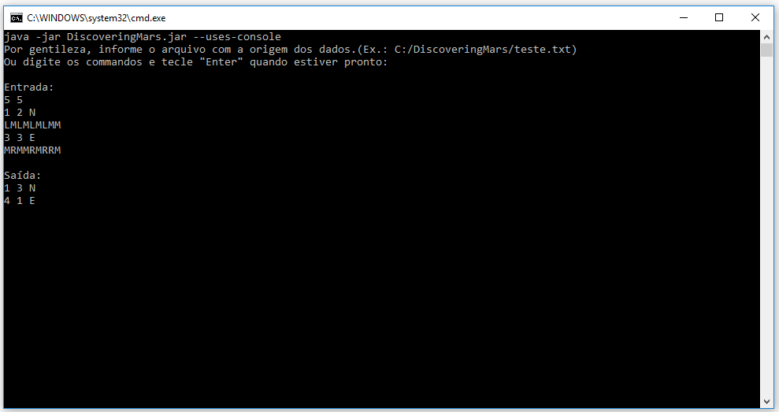

# DiscoveringMars
Uma missão em Marte (Cappta)

# How To
Acesse a pasta "Get Here" onde achará o arquivo "DiscoveringMars.jar" e o arquivo "teste.txt".
A aplicação foi desenvolvida em Java e é executável via console através do seguinte comando:

"java -jar "DiscoveringMars.jar" --uses-console"

Dentro da aplicação, é possível passar as intruções digitando linha a linha, ou passar o caminho para ler um arquivo de entrada que contenha as mesmas instruções.

Observação: Pode usar o arquivo de testes "teste.txt" para ver o efeito:




Ou digitar a entrada no console e concluir com a palavra "pronto":


# Entrada de Teste
```
5 5
1 2 N
LMLMLMLMM
3 3 E
MRMMRMRRM
```

# Saída esperada
```
1 3 N
4 1 E
```
# BONUS

É possível utilizar a aplicação em modo gráfico, basta abrir o arquivo "DiscoveringMars.jar" utilizando a Java JVM ou simplesmente executar o comando "java -jar "DiscoveringMars.jar" e se divertir."


